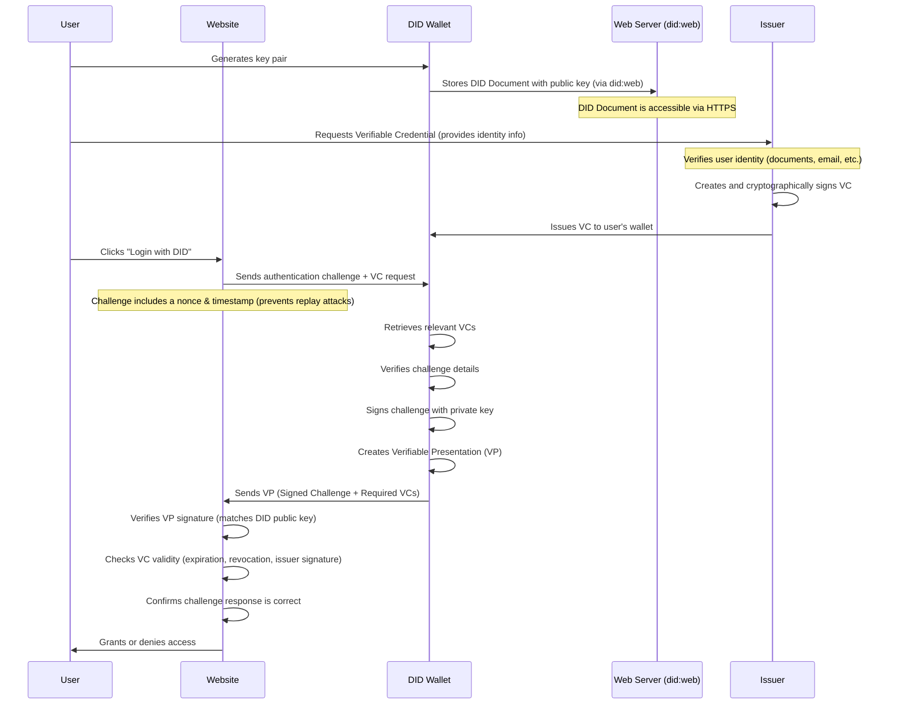

```mermaid
sequenceDiagram;
    participant U as User;
    participant W as Website;
    participant DW as DID Wallet;
    participant DB as Web Server (did:web);
    participant I as Issuer;

    %% DID Creation;
    U->>DW: Generates key pair;
    DW->>DB: Stores DID Document with public key (via did:web);
    Note over DB: DID Document is accessible via HTTPS;

    %% VC Issuance;
    U->>I: Requests Verifiable Credential (provides identity info);
    Note over I: Verifies user identity (documents, email, etc.);
    I->>I: Creates and cryptographically signs VC;
    I->>DW: Issues VC to user's wallet;

    %% Login Flow
    U->>W: Clicks "Login with DID";
    W->>DW: Sends authentication challenge + VC request;
    Note over W: Challenge includes a nonce & timestamp (prevents replay attacks);
    
    %% DID Wallet Processing
    DW->>DW: Retrieves relevant VCs;
    DW->>DW: Verifies challenge details;
    DW->>DW: Signs challenge with private key;
    DW->>DW: Creates Verifiable Presentation (VP);
    DW->>W: Sends VP (Signed Challenge + Required VCs);

    %% Verification
    W->>W: Verifies VP signature (matches DID public key);
    W->>W: Checks VC validity (expiration, revocation, issuer signature);
    W->>W: Confirms challenge response is correct;
    W->>U: Grants or denies access;
```